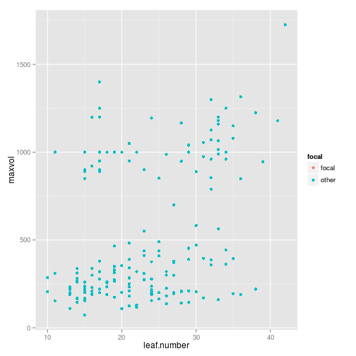

# Data from argentina

Here is a simple plot:

```r
physical %>% 
  mutate(focal = ifelse(site == dataset, "focal", "other")) %>% 
  ggplot(aes(x = leaf.number, y = maxvol, colour = focal)) +
  geom_point()
```

```
## Warning: Removed 30 rows containing missing values (geom_point).
```

 

