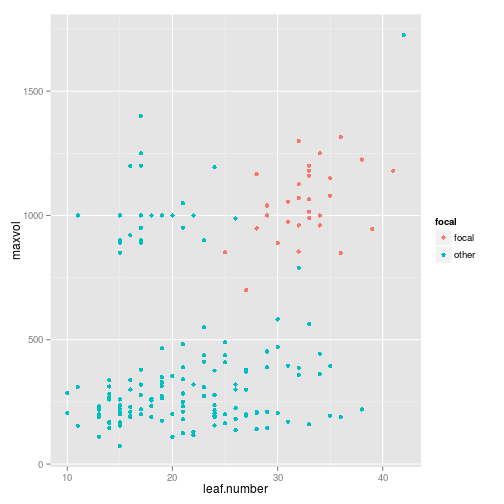
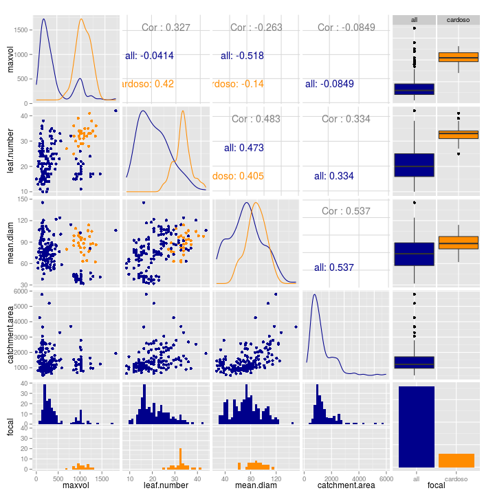

# Data from cardoso

Here is a simple plot:

```r
physical %>% 
  mutate(focal = ifelse(site == dataset, "focal", "other")) %>% 
  ggplot(aes(x = leaf.number, y = maxvol, colour = focal)) +
  geom_point()
```

```
## Warning: Removed 30 rows containing missing values (geom_point).
```

 

## Size variables


```r
sizepairs <- physical %>% 
  mutate(focal = ifelse(site == dataset, dataset, "all")) %>% 
  select(maxvol:catchment.area, focal) %>% 
  ggpairs(colour = "focal")

add_theme_to_ggpairs(sizepairs)
```

 


## Chemical variables -- initial


```r
sizepairs <- physical %>% 
  mutate(focal = ifelse(site == dataset, dataset, "all")) %>% 
  select(turbidity.initial:chlorophyll.initial, focal) %>% 
  ggpairs(colour = "focal")

add_theme_to_ggpairs(sizepairs)
```

 

#### Chemical variables to check


```r
set.seed(4812)
physical %>% 
  filter(site == dataset) %>% 
  select(site_brom.id, turbidity.initial:chlorophyll.initial) %>% 
  sample_n(3) %>% 
  mutate(`*CONFIRMED*` = "    ") %>% 
  as.data.frame %>% 
  kable
```


|site_brom.id  | turbidity.initial| oxygen.percent.initial| oxygen.conc.initial| ph.initial| chlorophyll.initial|*CONFIRMED* |
|:-------------|-----------------:|----------------------:|-------------------:|----------:|-------------------:|:-----------|
|cardoso_DEC31 |             34.41|                     NA|                  NA|        5.9|            -4.16772|            |
|cardoso_DEC53 |             49.40|                     NA|                  NA|        5.6|            -5.28360|            |
|cardoso_DEC35 |             56.24|                     NA|                  NA|        5.7|            -2.60508|            |

