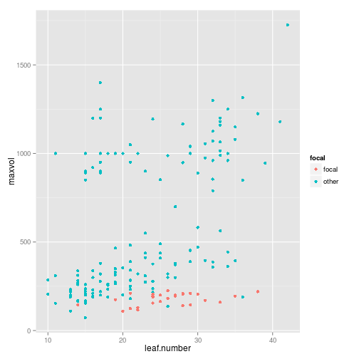
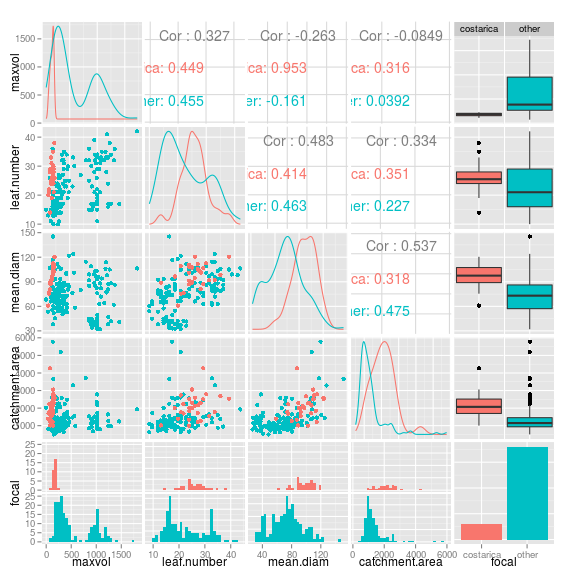
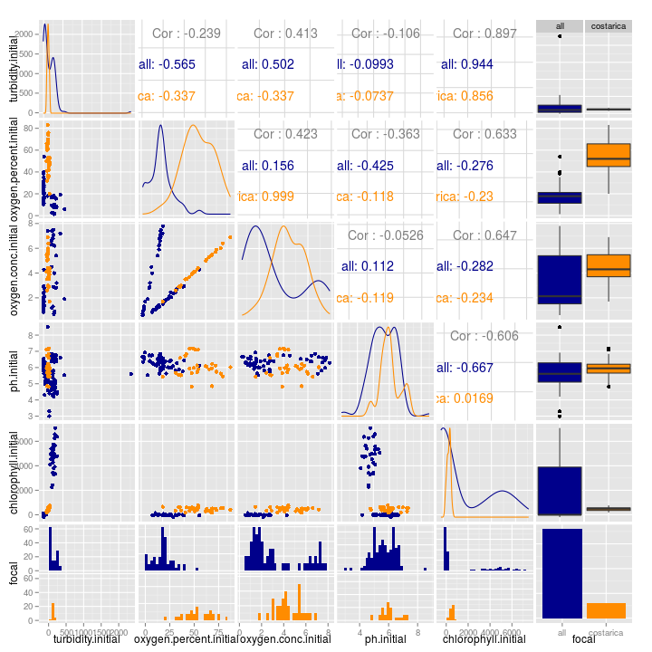

# Data from costarica

Here is a simple plot:

```r
physical %>% 
  mutate(focal = ifelse(site == dataset, "focal", "other")) %>% 
  ggplot(aes(x = leaf.number, y = maxvol, colour = focal)) +
  geom_point()
```

```
## Warning: Removed 30 rows containing missing values (geom_point).
```

 

## Size variables


```r
sizepairs <- physical %>% 
  mutate(focal = ifelse(site == dataset, dataset, "all")) %>% 
  select(maxvol:catchment.area, focal) %>% 
  ggpairs(colour = "focal")

add_theme_to_ggpairs(sizepairs)
```

 


## Chemical variables -- initial


```r
sizepairs <- physical %>% 
  mutate(focal = ifelse(site == dataset, dataset, "all")) %>% 
  select(turbidity.initial:chlorophyll.initial, focal) %>% 
  ggpairs(colour = "focal")

add_theme_to_ggpairs(sizepairs)
```

 

#### Chemical variables to check


```r
set.seed(4812)
physical %>% 
  filter(site == dataset) %>% 
  select(site_brom.id, turbidity.initial:chlorophyll.initial) %>% 
  sample_n(3) %>% 
  mutate(`*CONFIRMED*` = "    ") %>% 
  as.data.frame %>% 
  kable
```


|site_brom.id | turbidity.initial| oxygen.percent.initial| oxygen.conc.initial| ph.initial| chlorophyll.initial|*CONFIRMED* |
|:------------|-----------------:|----------------------:|-------------------:|----------:|-------------------:|:-----------|
|costarica_4  |             97.94|                     66|                 5.5|       4.85|            384.8067|            |
|costarica_36 |             89.35|                     60|                 5.0|       6.09|            288.6846|            |
|costarica_10 |            113.60|                     61|                 5.1|       6.07|            461.3436|            |

