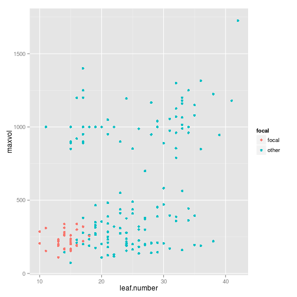
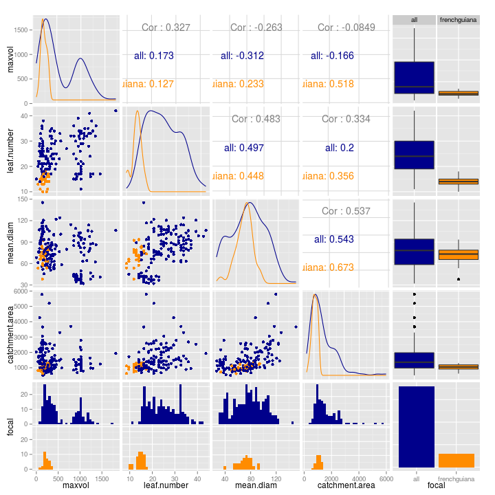

# Data from frenchguiana

Here is a simple plot:

```r
physical %>% 
  mutate(focal = ifelse(site == dataset, "focal", "other")) %>% 
  ggplot(aes(x = leaf.number, y = maxvol, colour = focal)) +
  geom_point()
```

```
## Warning: Removed 30 rows containing missing values (geom_point).
```

 

### Size variables


```r
sizepairs <- physical %>% 
  mutate(focal = ifelse(site == dataset, dataset, "all")) %>% 
  select(maxvol:catchment.area, focal) %>% 
  ggpairs(colour = "focal")

bw1 <- add_to_plots(sizepairs, scale_fill_manual(values=c("darkblue","darkorange")))

bw2 <- add_to_plots(bw1, scale_colour_manual(values=c("darkblue","darkorange")))

bw2
```

 

