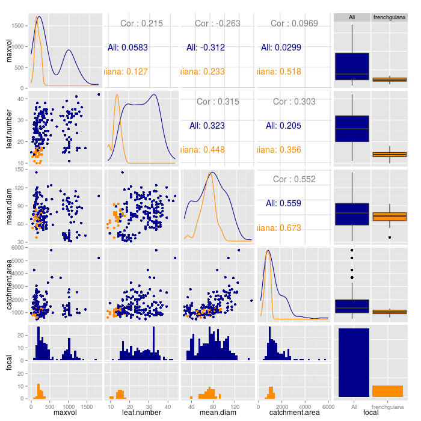
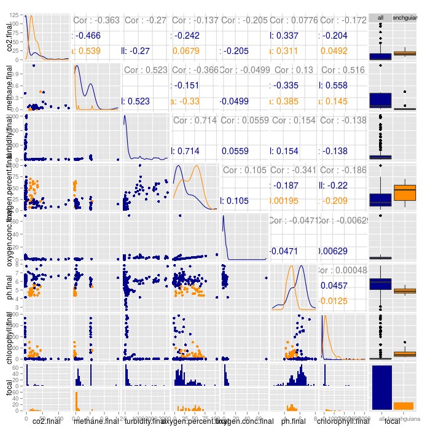

# Data from frenchguiana, compared to all other sites

This document shows how data from **frenchguiana** compares to data from all other sites. This comparison is useful for confirming that units, outliers and variation is similar everywhere.

These data were accessed on 14 September 2015

## Size variables

## Chemical variables -- initial

## Chemical variables -- final

## Ecosystem variables -- final

