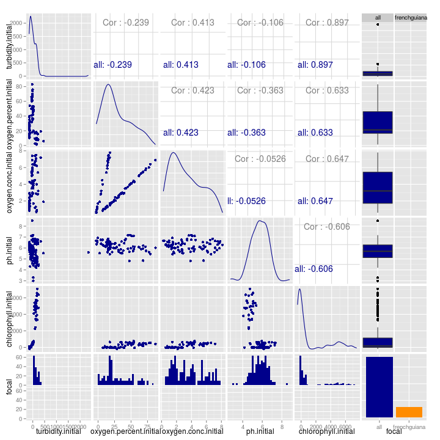

# Data from frenchguiana

Here is a simple plot:

```r
physical %>% 
  mutate(focal = ifelse(site == dataset, "focal", "other")) %>% 
  ggplot(aes(x = leaf.number, y = maxvol, colour = focal)) +
  geom_point()
```

```
## Warning: Removed 30 rows containing missing values (geom_point).
```

 

## Size variables


```r
sizepairs <- physical %>% 
  mutate(focal = ifelse(site == dataset, dataset, "all")) %>% 
  select(maxvol:catchment.area, focal) %>% 
  ggpairs(colour = "focal")

add_theme_to_ggpairs(sizepairs)
```

 


## Chemical variables -- initial


```r
sizepairs <- physical %>% 
  mutate(focal = ifelse(site == dataset, dataset, "all")) %>% 
  select(turbidity.initial:chlorophyll.initial, focal) %>% 
  ggpairs(colour = "focal")

add_theme_to_ggpairs(sizepairs)
```

 


